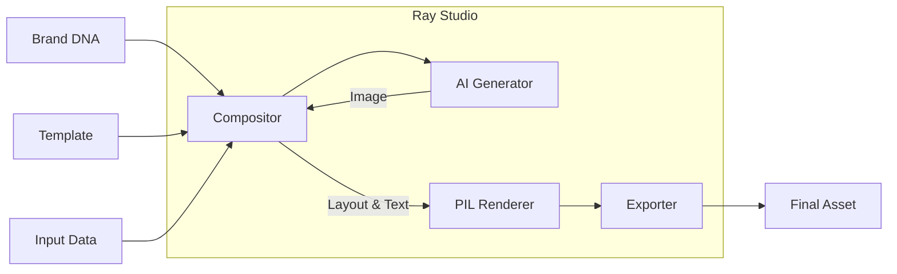

# Ray Studio 🎨

[AI-MANUAL.md](docs/AI-MANUAL.md) — **AI Agents: Read this first.**

AI-powered marketing asset generator — Holo-inspired visual production toolkit.

## Project Overview

Ray Studio is a visual generation engine designed to streamline the creation of on-brand marketing assets. It combines structured Brand DNA, flexible templates, and state-of-the-art AI generation (Flux/SDXL) to produce high-quality visuals for various platforms.

The core concept revolves around:
```
Brand DNA + Template + AI Generation = On-Brand Marketing Asset
```

Ray Studio handles the heavy lifting of composition, text placement, and image generation, allowing marketers to focus on strategy and creative direction. It serves as the visual production engine within the Promethia marketing ecosystem.

## Feature Overview

### 🎨 Visual Generation
Ray Studio utilizes **Flux** and **SDXL** models (via fal.ai or Replicate) to generate high-fidelity backgrounds and visual elements. The engine intelligently injects brand style ("minimalist", "vibrant", "professional") into the prompts to ensure consistency.

### 🧩 Smart Templates
Templates are not just static overlays. Defined using **Pydantic models**, they support dynamic layouts (stack, grid), conditional layers, and responsive text sizing. Templates separate content structure from visual style, allowing the same template to look completely different for two different brands.

### 🧬 Brand DNA
Brand DNA is a structured representation of a brand's identity, including colors, fonts, tone, audience, and products. This "source of truth" is automatically applied to every asset generated, ensuring 100% brand compliance without manual checking.

## Architecture

Ray Studio follows a linear pipeline architecture:



1.  **Input Resolution**: The CLI or API receives a template selection, Brand DNA, and specific inputs (headline, CTA).
2.  **AI Generation**: If the template requires a generated background or element, the `Generator` constructs a prompt based on the template description and Brand DNA tone, then calls the AI provider (e.g., fal.ai).
3.  **Composition**: The `Compositor` assembles layers. Text is rendered using brand fonts, colors are applied from the palette, and elements are positioned according to the layout rules.
4.  **Export**: The `Exporter` optimizes the final image for the target platform (e.g., compressing for Web, converting to CMYK for Print).

## Installation

Ray Studio requires Python 3.9 or higher.

1.  **Clone the repository:**
    ```bash
    git clone https://github.com/your-org/ray-studio.git
    cd ray-studio
    ```

2.  **Install dependencies:**
    ```bash
    pip install .
    ```

    For development (including testing tools):
    ```bash
    pip install -e ".[dev]"
    ```

3.  **Configuration**:
    Set your API keys in the environment:
    ```bash
    export FAL_API_KEY="your_key_here"
    ```

## Quick Start

Generate your first asset in seconds.

1.  **Create a Brand DNA file (`brand.yaml`):**
    (See `examples/client_dna_example.yaml` for a full example)
    ```yaml
    brand:
      name: "Acme Corp"
      tagline: "Quality First"
      colors:
        primary: "#007BFF"
        secondary: "#6C757D"
        accent: "#28A745"
        background: "#F8F9FA"
        text: "#343A40"
      fonts:
        heading: "Arial"
        body: "Helvetica"
        accent: "Courier New"
      tone: "professional"
      expression: "minimalist"
      logo:
        primary: "path/to/logo.png"
    ```

2.  **Generate a Promo Image:**
    ```bash
    ray-studio generate promo \
      --dna brand.yaml \
      --output promo.png \
      --headline "Summer Sale" \
      --subheadline "50% Off Everything"
    ```

## Customization Guide

### Brand DNA Modifications
The `BrandDNA` schema (`src/ray_studio/dna/schema.py`) is the contract for your brand.
- **Colors**: You can define `primary`, `secondary`, `accent`, `background`, and `text`.
- **Fonts**: Ensure font files are accessible or installed on the system.
- **Tone/Expression**: These fields directly influence the AI prompts. Use descriptive adjectives like "gritty", "luxurious", "playful".

### Creating Custom Templates
Templates are defined in `templates/*.yaml` or programmatically in `src/ray_studio/templates/`.
A basic YAML template looks like this:

```yaml
name: my_custom_template
layout:
  type: stack
layers:
  - type: background
    source: ai_generate
    prompt_template: "A {dna.brand.tone} background image of a workspace"
  - type: text
    content: "{input.headline}"
    font: dna.brand.fonts.heading
    color: dna.brand.colors.primary
inputs:
  headline:
    type: string
```

Refer to `src/ray_studio/templates/base.py` for the full Pydantic definition of `Layout` and `Layer`.

## Performance Tuning

### Batch Processing
For generating assets for multiple platforms (Instagram, LinkedIn, Email), use the `batch` command. This is faster than running `generate` multiple times because it reuses the base composition logic where possible and handles file I/O efficiently.

```bash
ray-studio batch promo --dna brand.yaml --output-dir out/ --presets instagram_post linkedin_post
```

### Export Optimization
Ray Studio uses `Pillow` for image processing.
- **WebP**: Use `--format webp` for smaller file sizes with high quality.
- **Presets**: Custom presets can be defined in `src/ray_studio/export/presets.py` to tune JPEG quality (default is 90). Lowering this to 80 can significantly reduce file size without visible degradation.

## Troubleshooting

| Issue | Possible Cause | Solution |
| :--- | :--- | :--- |
| `FAL_API_KEY not set` | Environment variable missing | Run `export FAL_API_KEY=...` or check `.env` file. |
| `Template not found` | Typo or file missing | Run `ray-studio templates` to list available templates. |
| `ValidationError: Field required` | DNA file missing fields | Compare your YAML with `src/ray_studio/dna/schema.py` or `examples/client_dna_example.yaml`. |
| `OSError: cannot open resource` | Font file missing | Ensure the font name in DNA matches a system font or provide a full path. |

## Integration

### Python Library Usage
Ray Studio can be imported as a Python library for deeper integration.
See `examples/python_integration.py` for a complete example of loading DNA, rendering a template, and exporting programmatically.

```python
from ray_studio.dna import load_dna
from ray_studio.compositor import Compositor

dna = load_dna("brand.yaml")
# ... see examples/python_integration.py
```

### Promethia Pipeline
In the Promethia ecosystem:
1.  **Iris (Strategy)**: Determines the campaign angle.
2.  **Nina (Copy)**: Writes the "headline" and "cta" inputs.
3.  **Ray Studio**: Receives inputs via CLI or API and generates the visual.
4.  **Zaptos (Delivery)**: Distributes the generated PNG/JPG to WhatsApp or Social Media.

### Zaptos / WhatsApp Integration
To generate assets for WhatsApp:
```bash
ray-studio generate promo \
  --dna brand.yaml \
  --preset whatsapp_status \
  --output whatsapp_ad.jpg
```
The `whatsapp_status` preset ensures the dimensions (1080x1920) and file size are optimized for mobile delivery.

## Advanced Workflows

### Multi-Platform Campaign
Generate a cohesive campaign across 5 platforms with one command:

```bash
ray-studio batch product_showcase \
  --dna brand.yaml \
  --output-dir ./campaign_launch/ \
  --presets instagram_post facebook_post linkedin_post twitter_post whatsapp_status \
  --headline "New Arrival"
```

### Figma Bi-Directional Sync
(Requires Figma Plugin)
Ray Studio can read text nodes from Figma to use as inputs, or update Figma text nodes with AI-generated copy.
- **Scan**: `ray-studio figma scan-text <node_id>`
- **Update**: `ray-studio figma set-text <node_id> "New Text"`

## Roadmap

- [ ] **Video Generation**: Integration with Runway/Pika for motion backgrounds.
- [ ] **Lottie Animation**: Support for animated vector overlays.
- [ ] **Headless Mode**: API server for real-time generation requests.
- [ ] **DNA Extractor**: Auto-generate Brand DNA from a website URL.
- [ ] **Local LLM**: Run Flux/SDXL locally if GPU is available (skipping API costs).

## Examples

### CLI Examples
- **Testimonial**:
  ```bash
  ray-studio generate testimonial --dna brand.yaml --output quote.png --quote "Amazing!" --author "Jane"
  ```
- **Product Showcase**:
  ```bash
  ray-studio generate product_showcase --dna brand.yaml --output product.png --product_name "Widget" --features "Fast\nCheap"
  ```

## Contributing

Contributions are welcome!

1.  **Fork the repository.**
2.  **Create a feature branch.**
3.  **Install dev dependencies:** `pip install -e ".[dev]"`
4.  **Run tests:** `pytest`
5.  **Submit a Pull Request.**

## License

MIT License. See `LICENSE` for details.
